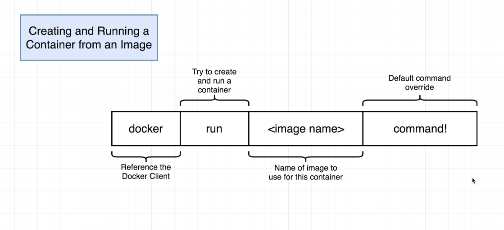
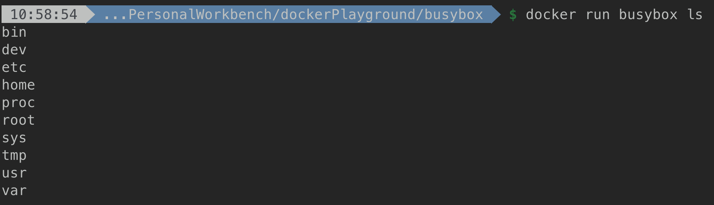
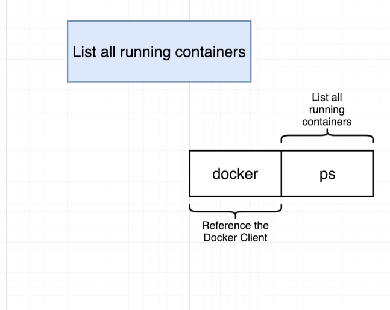

# Manipulate Docker Containers

## Freq docker cmd

### docker run cmd
> $ docker run {image_name} {command}

`docker run` command is a starting cmd we can use to trigger docker to run an image, it is often used within image as the starter cmd. In short, it creates and runs a Conatiner for an image.

> $ docker run busybox ls

However, above folders/files will not show up in your file system if you try to find it with `File Explorer` with windows or `Finder` in mac. Because those are files/folders within your image Container. In another word, those are necessary files/folders from your docker image, and they got copied to the docker container while excuting the `docker run` cmd.

**Note**: while use below cmd with `ls` or `echo` as default cmd, it will not work

> $ docker run hello-world ls

> $ docker run hello-world echo hi there

The reason is that, the hello-world image file system snapshot does not support `ls` or `echo` cmd, it does not have any executables for `ls` or `echo`.

### docker ps cmd

> $ docker ps

> $ docker ps --all

To list all the containers ever created

### docker logs

> $ docker logs {container id}

Get all the logs for the container and print logs to terminal. Really useful while debugging and testing.

## Container lifecycle

`docker run` = `docker create` + `docker start`

### Creating a Container
> $ docker create {image name}

It prepares the file system for the container from the image, and then returns the container_id so you can use it to start the container.

### Starting a Container
> $ docker start {container id}

It runs the container with the starter cmd from image. Normally, you want to run `docker start` with `-a`
> $ docker start -a {container id}

since it will print all the output logs from container and paste in your terminal. (without `-a`, the terminal will only print the container id for your information)

### Stopping/Killing a Container
> $ docker stop {container id}
It will send a `SIGTERM` (signal termination) to the container, tell it to shut down from itself. So the container can shut down with some file save and do some clean up on its own. On default, it gives container **10 secs** to shut down.

> $ docker kill {container id}
It will send a `SIGKILL` (signal kill) to the container, and tell it to stop immediately.

### Restart a stopped container
**Note**: you can still start a stopped container by using container id in `docker start` cmd

However, we will not be able to rewrite the starter cmd we used to issue for `docker start` last time.

### Deleting Stopped Containers
> $ docker system prune

**Note**: This cmd should be used with care.
It will remove all stopped containers, dangling images, build cache and networks not used by at least one container.

## Multi command Container

### Why do we need multi command container

Consider below as an example:
When trying to run redis on local machine, we need to run `redis-server` to start redis server and `redis-cli` to connect to redis server, then do data manipulation from redis-cli itself. However, we running redis with docker, if we run `redis-server` and `redis-cli` in different container, they will not connect with each other because there will be no connections between container and local machine. They will only recognize each other while they are running within the same container. 

That's where we need multi command container.

### How to execute another command within container

> $ docker exec -it {container id} {command}

`-it` allows us to provide input from keyboard to the container. It is actually a combination of `-i` and `-t` flag:
- `-i` : It adds our terminal to the running process's `STDIN` channel, which allows us to open up the standard input from terminal to the container and interact with container
- `-t` : Make sure all the text you entered got formatted nicely.

Above command will help to execute a command within a given container. It supports us to run a second running program within the container.

### Get access to shell for container

It is the most frequent used why of interacting with a running container, because we don't need to use `docker exec...` all day long to execute commands within given docker container.

> $ docker execs -it {container id} sh

Above will open the shell from container itself, and allow us to execute cmds directly. (**Note** : `cmd + c` will not kill the shell, please use `cmd/ctrl + d` or type in `exit` to kill/exit the current shell and return to your local terminal)

**Note**: We can also use `docker run` with `-it` flag to access container shell
> $ docker run -it busybox sh

## Container Isolation

There will be no sharing of data between docker Containers, each of the container has its own File Systems and its independent of other containers.
