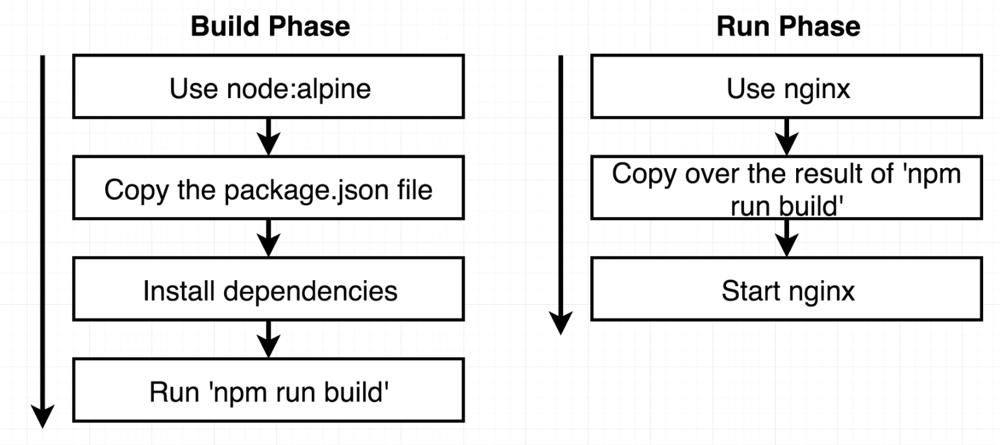

# Project1: React Project with Docker CICD

## Run React Project with Docker

### Creat seed react project with npx.
Having issue while creating project with `npx`, seems a conflict problem with `yarn`

### Build project docker image and host with docker container

Build `Dockerfile.dev` for non-prod env.

> $ docker build -f Dockerfile.dev

Run image at localhost

> $ docker run -it -p 3000:3000 {image_name}

**Note**: Cannot run without `-it` tag due to latest updates with react app.

### Use Docker Volumes to host application without rebuild image while developing on local

Earlier when we try to build a docker image and run docker image, we always make use of the file system snapshot to support our app. However, while developing at local, when we make changes our code, it will not directly reflect on the container image unless when rebuild the image with `docker build`. And `Docker Volume` is the solution that we can make use of to resolve this problem.

`Docker Volume` is kind of making a reference from your docker image fs snapshot to your local project folder/files, that way whenever you make changes to your code, with the same reference it will reflect your changes directly to your app.

We can try `-v` withint `docker run` to use volumes:

> $ docker run -it -p 3000:3000 -v $(pwd):/app {image_id}

If you wish to use the `node_module` dependencies within the container instead of your working dir, you can bookmark the node_modules:

> $ docker run -it -p 3000:3000 -v /app/node_modules -v $(pwd):/app {image_id}

For the `:` within the `-v` content,
- if we add the `:` like this: `$(pwd):/app`, basicallly we are saying that we want to map whatever form our current directory to `/app` folder
- if we don't add the `:`, such as this: `'v /app/node_modules`, we are not expecting any mapping there, we will just use it as it is on that folder/dir.


## Run Project Tests

To run our tests with docker, we need to first build the docker image:

> $ docker build -f Dockerfile.dev . -t {tagName}

WIth the `tagName` or `imageId`, we can insert the override command to run it

> $ docker run {imageId} npm run test

Then, how to **live updates test**, we can have two options:
1. (**Cannot interact with Process**)Docker compose for running tests, add another docker compose `service` for running tests. However, we still have to use `docker ps` and `docker exec -it {containerId} sh` to get into container and watch those tests.
2. (**Kind of Complicated**) Within the running container of our web app from docker compose, we can try to run tests, since all the necessary packages and code are there:
   1. Try `docker ps` to get hold of current container id
   2. Use `docker exec` to run command within container
      > $ docker exec -it {containerId} npm run test

## Run Project Builds

In Dev env, we are making use of **dev server** to serve up the project locally. However, in the prod env, we will need another server to replace the **dev server** we had on dev env. Since **dev server** contains too much processes within it and not ideal for real prod server to use. A prod server only needs to receive the traffic from network and serve up necessary html/js back, since we don't make changes to the js/html file anymore. And `Nginx` is one of the most popular tool to do this.

  

```Docker
# Build Phase to install all deps and app
FROM node:alpine as builder
WORKDIR '/app'
COPY package.json .
RUN npm install
COPY . .
CMD ["npm", "run", "build"]


# Run Phase to run app build within folder /app/build
FROM  nginx
COPY --from=builder /app/build /usr/share/nginx/html
# /usr/share/nginx/html is the default directory that nginx will serve without config

```

We can run `docker build .` to build up the image and use port mapping

> $ docker run {image_id} -p 8080:80

to serve the app at port 8080 (the default port for nginx is port 80)

## React Project CICD implementation

### Create Git Repo
Create basic git repo `docker-react` and push existing local code to the repo.
### Link Git repo with Travis CI account

Sign in to Travis CI with github account, and within the settings page, mark our project to link with travis CI, which means any time there is a change with my repo, Travis CI is going to do something with it based on my configuration under travis yml(`.travis.yml`) file.

```yml
sudo: required
language: generic

services:
  - docker

before_install:
  - docker build -t nathan/docker-react -f Dockerfile.dev .

script:
  - docker run -e CI=true nathan/docker-react npm run test
```

**NOTE:** make sure you are using `travis-ci.com` instead of `.org`, although the documentation is saying that those two sites are treated equally, I am experiencing a much more faster job execution on `.com` site. On the `.org` site, jobs will be **Queued** for a really long time before they got executed.

### Config Travis CI with AWS Elastic Beanstalk to deploy app
1. Create an app and env within AWS Elastic Beanstalk
2. Set up IAM app key and secret key, and use these keys value as config within travis ci for security
3. Use those keys along with AWS Elastic Beanstalk URL to config  travis yml file within deploy tag


```yml
sudo: required
language: generic

services:
  - docker

before_install:
  - docker build -t nathan/docker-react -f Dockerfile.dev .

script:
  - docker run -e CI=true nathan/docker-react npm run test

deploy:
  provider: elasticbeanstalk
  region: "us-east-2"
  app: "docker"
  env: "Docker-env"
  bucket_name: "elasticbeanstalk-us-east-2-850608830989"
  bucket_path: "docker"
  on:
    branch: master
  access_key_id: $AWS_ACCESS_KEY
  secret_access_key: $AWS_SECRET_KEY

```