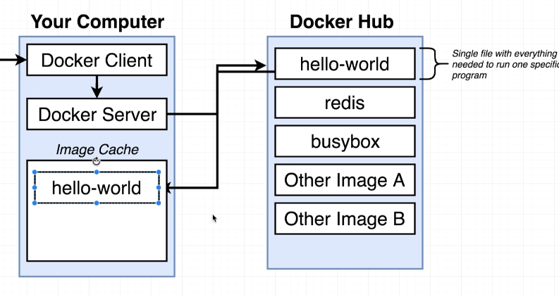

# Introduction to Docker

## Why use Docker

Way much easier to install and use software without knowing the dependencies

## What is Docker

**Docker** is a platform or ecosystem, containing **Docker Client(Docker CLI), Docker Server(Docker Daemon), Docker Images, Docker Compose...**, which is around creating and running docker containers.

Then What is a docker Container? What is a Image?

- **Image**: A single file with all the deps and config required to run a program
- **Container**: Instance of an image. A running program

## Docker for Operating Systems

- **Docker Client(Docker CLI)** : Tool that we are going to issue commands to
- **Docker Server(Docker Daemon)**: Tool that is responsible for creating images, running containers...

## Hello World from Docker

### How to run a `hello world` from docker
To run docker hello world, use below cmd:
>$ docker run hello world

The sole job is to print out the hello message to confirm you have the settings correct for docker.

### Then what happens after you insert the cmd to docker for the first time?

### What happens if you run it the second time?
The first message `unable to find image 'hello-world:latest' locally` is no longer there, because docker can see from the image cache that you have downloaded the image for `hello-world` there.

## Still, what is a `Container`?

Imagine below scenario for example:
- We need to run an application, like chrome
- It needs python support which your current OS kernel does not have
  
The normal way to solve this problem is that our OS will need to allocate some space and download the necessary package like python, then give it a namespace so chrome knows where to find it in our OS. 

A `Container` actually means the whole set of solution above, it contains:
- The running process (like chrome)
- Part of kernel computation (To allocate memory to run chrome, hard disk space to store packages, external network call etc)
- Combination of resouces like Hard Drive, RAM, Network, CPU

From above diagram, we can see that docker `Image` actually contains two part:
1. FS Snapshot: contains the file system that stores the packages, dependecies it needs to run the app
2. Startup Cmd: contains a starter `cmd` to run the application

So, when docker needs to run an image:
1. It copies the `FS snapshots` into the hard disk, so that it has all the deps.
2. It uses the startup cmd to run the application

Then the running app, kernel software and all the resources consist the docker `Container`.

## What you are actually running while running `Docker`?
With `Docker` running, you are actually running a `Linux Virtual Machine` on your machine, which manage it's own process with `Linux Kernel`