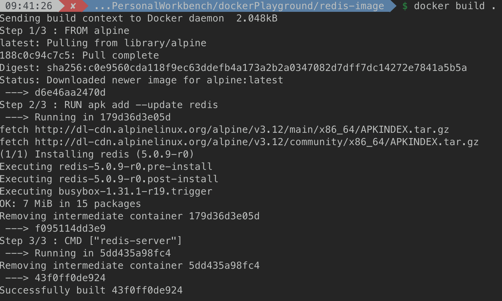

# How to build a docker image?

## Overall Process of building a custom docker image
- DockerFile (Configuration to define how container should behave)
- Docker client (Docker cli provide file to docker server)
- Docker Server (Take docker file and config and turn it into a usable docker image)
- Usable Image (Can be then used for docker run)

## Sample App : Create Image to run redis-server

We can create a `Dockerfile` as below:
```Docker
# Use an existing docker image as a base
FROM alphine

# Download and install a dependency
RUN apk add --update redis

# Tell the image what to do when it starts as a container
CMD ["redis-server"]
```

Then, to build the image from dockerfile, please run:
> $ docker build .

With the returned image_id, we can use `docker run` to start a container for it.

### DockerFile instructions explanation
- `FROM` : use to specify a docker image you want to use or as a base
- `RUN` : use to execute some cmd while preparing custom image
- `CMD` : what should be executed when our image is used to start a new container

### What's the process of building an image

1. Write a docker file
  This is almost the same as **Being given a computer without OS and being told to install Chrome**, you will most likely do something like this: 
  - install OS = Prepare a base image 
  - start defatul browser ->
   navigate to google.com -> download installer -> open file explorer -> execute chrome installer = Run cmd to install dependencies for image
  - execute chrom after installer finished = Cmd to run on startup

2. `docker build` takes dockerFile and build a custom image out of it.

3. Executing each instructions from dockerFile:
   
    
  - Step1 : Executing `FROM`
    - Download `alpine` image
    - Take snapshot, turn it into image with imageId : `d6e4...`
  - Step2 : Executing `RUN`
    - Run docker image from last step on container with id of `179d...` (temp container)
    - Fetch and install redis within container file system by running cmd within temp container:
      > $ apk add --update redis
    - Take a snapshot of the container's new file system (with redis package included)
    - Shut down container `179d...`
    - Turn snapshot into image(id of `f095...`), and get it ready for next instruction
  - Step3 : Executing `CMD`
    - Run docker image `f095...` from last step with container id of `5dd4...`
    - Put cmd below as the startup cmd for container
      > $ `redis-server`
    - Take a snapshot of container's current fs and updated startup cmd
    - Shut down intermediate container `5dd4...`
    - Turn snapshot into image with id of `43f0...`, and gets it ready as our custom image for later usage.

4. docker rebuild with cache: docker can cache previous image and use cache while rebuild docker image, if it detects your docker cmd will return the same image as before. Meanwhile, it will print `using cache` in your terminal to inform you it is using a docker cache image now.
  - Docker will check the changed line of your dockerFile from previous image, and uses cache before your changed lines. After your changed line, docker will do as it first execute the cmds.

### Tag your docker image

> $ docker build -t {tag name} .

- `-t` : means tag the image with a name
- tag name : {docker_id}/{repo/proj name}:{version}
  - version: should be `latest` normally, you can also use a number to represent
- `.` : Use current directory as context

Then when you run docker image there, you don't need to copy and paste your image id to start your container, instead you can do:
> $ docker run {tag name}

Such as: 
> $ docker run nathansun1024/redis:latest

or:
> $ docker run nathansun1024/redis

Since `:latest` is default.

### Build Image Not from default Dockerfile

If we need to build an image not from the default `Dockerfile` but from file like `Dockerfile.dev` for non-prod env, you can use `-f` to accomplish that:

> $ docker build -f {fileName} .
