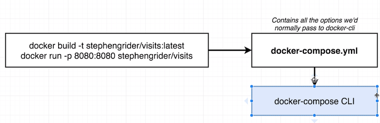
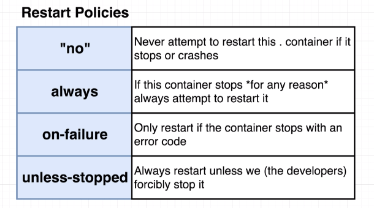

# Docker Compose

Docker Compse is a
- Separate CLI that gets intalled along with docker
- Used to start up mulitple Docker containers at the same time
- Automates some of the long-winded arguments we were passing to `docker run`

In all, **Docker Compose** is another form a docker CLI that allows you to issue multiple docker cmd easily.



## Docker CLI -> Docker Compose CLI
- > $ `docker run my-image` 
  
  => 
  > $ `docker-compose up`

- > $ `docker build .` 
  
  > $ `docker run my-image`
  
  =>
  > $ `docker-compose up --build`

- Luanch in background:
  > $ docker-compose up -d

- Stop Containers:
  > $ docker-compose down

- Container status:
  > $ docker-compose ps

  Kind of Different from `docker ps`, `docker-compose ps` is looking for a `docker-compose.yml` file within the same directory and try to see all the services/containers running status listed within this docker compose file.

## Docker Compose

Docker compose file example:

```docker-compose
version: '3'

services:
  redis-server:
    image: 'redis'
  node-app:
    restart: always
    build: .
    ports:
      - "4000:8081"
```


### Docker Restart Policy
Docker Restart is controlled by the `restart` field stated in services. 

It has 4 different values to have different behavior when restart needed.



