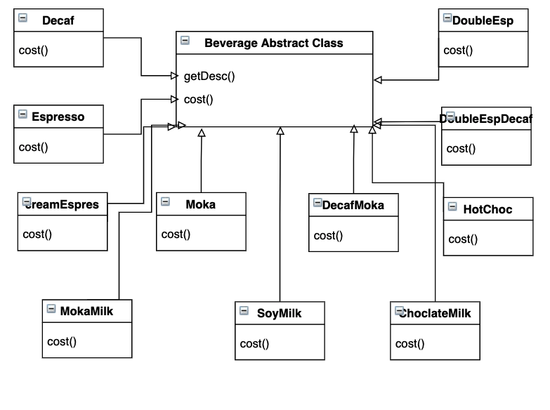
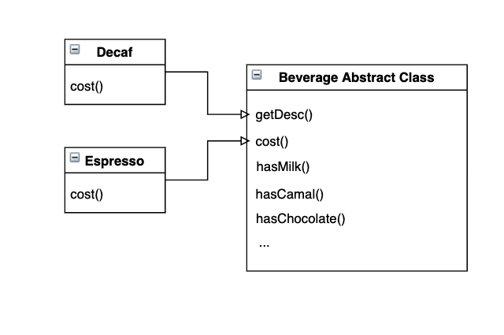
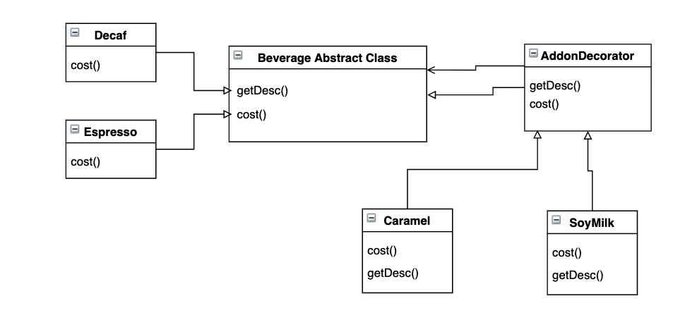

# Decorator Pattern

## Official Definition
`Decorator Pattern` attaches additional responsibilities to component, it provides flexible alternaty to subclassing while extending functionality

## Why do we need this Pattern? What does it try to solve

Normally, subclass inheritance will not help us on code sharing, it only gives us a hierarchy, yes, sometimes it splits our code into reasonable smaller chunks and each chunk will only need to do very specific things there, however, it could easily lead to a class explotion like below: 



Base products with different add-on selections can be a different product with distinct cost, they will also need to extend from the base class, for example, user would like a Decaf with SoyMilk and HotChocolate, which we will need a new class like `DecafMilkHotChoc` to extend from base class. So each concrete class would actually be a base flavor or an addon, that will create a mess for us when we have tons of new base products and add-on mixing together. Then, we might have an temp solution which can do a split of flavor and add-on for us:



This way we make each addon a property within the Beverage Base Class to control it while user wants to order, and it would be easier for us to calculate cost later. We have to admit that this works in a small scale of flavors and add-on, however, when add-on gets more, the Beverage class starts to grow larger, more importantly, base products like `Tea` or `Lemonade` **DO NOT** actually need add-on like Milk, Camal or Chocolate, so we are forcing those product classes to have  unnecessary properties since it is built into the base class. And this is not good enough.

`Decorator Pattern` can provide us a new strategy to resolve the problem in this case.



Define two groups of classes:
1. Base Product Class: Decaf, Espresso, Lemonade, Tea, Moka...
2. Addon Class: SoyMilk, Carmal, Hot Choc...

The `AddonDecorator` is still a `Beverage` from above UML diagram, and it will has a `Beverage` instance so it can calculate the cost and display the description based on it.

To implement `cost()` function:
1. for Base Product Class, we can simply do:
    ```javascript
    cost() {
      return 1;
    }
    ```
2. for Addon Class, since it contains an instance from `Beverage` class, we can do:
    ```javascript
    cost() {
      return this.beverage.cost() + 2;
    }
    ```
