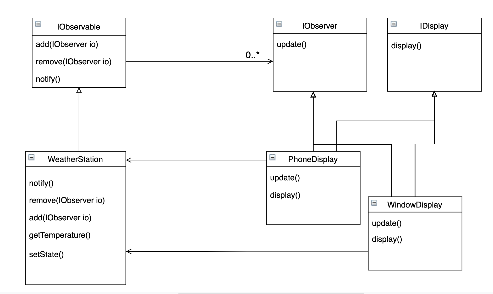

# Observer Pattern

## Official Definition
`Observer Pattern` defines a one to many dependency between objects so that when one object changes its state, all the other dependencies are notified the state change and update automatically.

## Why do we need this Pattern? What does it try to solve
It's really a matter of : **Push vs Poll**

Imagine we have a client observer and a state object, typically if we want to execute something while state object change, we would like our client observer constantly fire inqury checking the state and compare the response with the last response to make sure whether it has been changed or not, this inqury may be filed each sec or mini-sec. This is a Poll mechanisim, which means you are actively checking things until you got the change fo state.

However, to save the total times of inqury, what we really want is a Push mechanisim, which is whenever there is a state change, we notify the client observer. This is what `Observer Pattern` wants to solve. With this idea in mind, we can name the client observer and state object as `Observer` and `Observable` (an `Observer` is observing an `Observable`).


To have an `Observer` receive notifications from `Observable`, the first thing is that we should register `Observer` within `Observable`, so `Observable` knows where to push when the state changes. The `add()` and `remove()` function are built for manipulating the `Observer` array for later notifications(). `notify()` is the actual function that would notify all the current registered `Observer`.

## How to implement strategy pattern
```javascript
interface IObservable {
  add(IObserver o);
  remove(IObserver o);
  notify();
}

interface IObserver {
  update();
}

class WeatherStation implements IObservable {
  observers = [];
  add(IObserver o) {
    this.observers.add(o);
  }
  remove(IObserver o) {
    this.observers.remove(o);
  }
  notify() {
    this.observers.forEach(o => o.update());
  }
  getTemperature() {
    return this.temperature;
  }
  setState() {
    // state change code
    ...
    // notify observers
    this.notify();
  }
}

class PhoneDisplay implements IObserver {
  constructor(station: WeatherStation) {
    this.station = station;
  }
  update() {
    console.log('Current temperature changed to: ',this.station.getTemperature());
  }
}
```

While using the `WeatherStation` class instance as an Observable:
```javascript
WeatherStation station = new WeatherStation();
PhoneDisplay pDisplay = new PhoneDisplay(station);
station.add(display);
```

## Thoughts on Observer Pattern

1. For the `Observer Pattern` implementation:
   
    It seems like we are circling dependencies on this implementation for the first look, but it woud require more detail work if we want to avoid this. For example, we can avoid having `PhoneDisplay` depend on `WeatherStation` Observable:

    ```javascript
      class WeatherStation implements IObservable {
        observers = [];
        ws: WeatherState;
        add(IObserver o) {
          this.observers.add(o);
        }
        remove(IObserver o) {
          this.observers.remove(o);
        }
        notify() {
          this.observers.forEach(o => o.update(ws));
        }
        setState() {
          // state change code
          ...
          // notify observers
          this.notify();
        }
      }

      class PhoneDisplay implements IObserver {
        update(ws WeatherState) {
          console.log('Current temperature changed to: ', ws.temperature);
        }
      }
    ```
    Generally, it should work just fine. But as you can see, if the `WeatherState` contains too much info, different Observers might just need a little portion of it, then we might need to consider either move back to the original one or separate some parts out to have another Observable instance.

2. Thoughts on using `Observer Pattern`

    As an angular developer, we knew that `Observable` is constantly used within Angular since 2+, however, I've never thought that name came from this pattern. This is a great opportunity to learn and understand why would the framework built that way. 

    State management is always the core for web apps, and `Observer Pattern` gives a great example on how we can implement it. It always reminds me of the push notification strategy from BE to FE, we don't always need to send checking api calls to ask for current states (whether data has processed, whether uploads is successful etc).

  