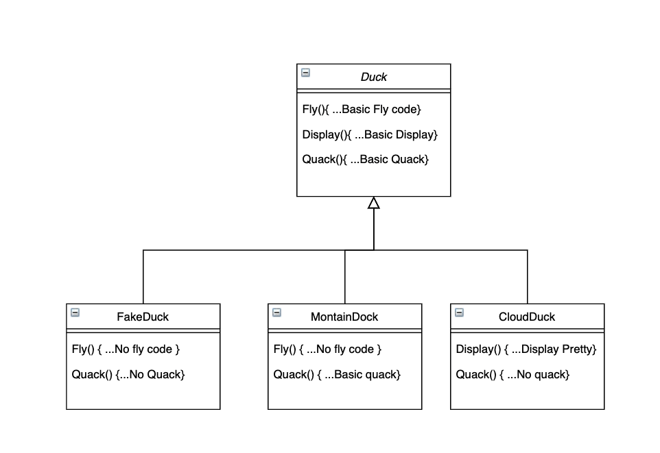
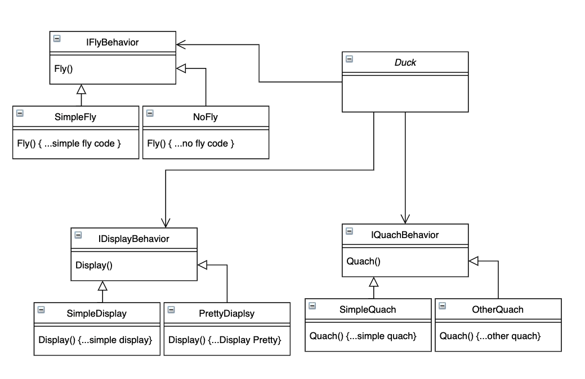

# Strategy Pattern

## Official Definition
`Strategy Pattern` also known as `policy pattern` is a behavioral software design pattern that enables selecting an algorithm at runtime. Instead of implementing a single alrogithm directly, code receives run-time instructions as to which in a family of algorithms to use.


## Why do we need this Pattern? What does it try to solve

Normally, we do heirarchy for classes to share the reusable methods downwards to the children from parent abstrcut/concret class, of course, child can have the ability to implement the method on a different way. However, when a heirarchy goes larger from one parent like below, usually what is going to happen is that lots of code need to be shared between children



As above class diagram showed, there are two methods that should be shared:
1. the `fly()` methods within `FakeDuck` and `MountainDuck` 
2. the `quack()` methods with `FakeDuck` and `CloudDuck`

However, with the top-down heirarchy design with inheritance, those can only be duplicated within different subClasses. Then, what can we do to resolve this?

**Strategy Pattern** is designed to resolve this:

We can build behavior interfaces to gather the behaviors togather, each behavior interface is called a strategy, each behavior class is called a concret strategy for later use. And we can assign them to the `Duck` class or subclasses at runtime as dependency injection, then there is no need for `Duck` class to have all the subclasses there, we can easily config the `Duck` to have different behavior to form either fake duck, montain duck or cloud duck based on our need at runtime, which we can show in below diagram



This gives us enough flexibility `Duck` class to continue grow, and also avoid the duplicate codes that we were going to put while using the inheritance design previously.

## How to implement strategy pattern

```javascript
Class Duck {
  let fb: IFlyBehavior;
  let qb: IQuackBehavior;
  let db: IDisplayBehavior;

  constructor(
    IFlyBehavior fb,
    IQuickBehavior qb,
    IDisplayBehavior db,
  ) {
    this.fb = fb;
    this.qb = qb;
    this.db = db;
  }

  fly(): void {
    this.fb.fly();
  }

  quack(): void {
    this.qb.quack();
  }
}
```

while using the `Duck` class:
```javascript
const fakeDuck = new Duck(
  new NoFly(),
  new OtherQuack(),
  new SimpleDisplay(),
);

// when you want your fakeDuck to fly
fakeDuck.fly();
```

## Thoughts on Strategy Pattern
When talking about reuse methods/code, devs always want to make heirarchy their on the first instinct, however, there are scenarios that `Strategy Pattern` would be a better choice to keep the code structure flexible and easy to implement. Try to think about some other patterns before you apply a heirarchy there, because once a heirarchy is implemented, it is hard to maintain and refactor later on.
